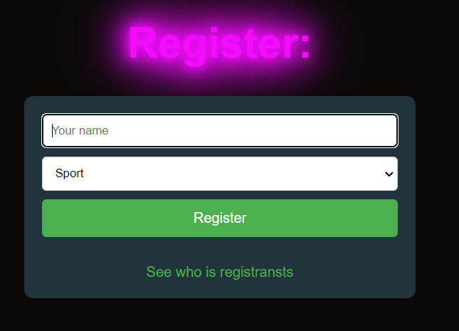

# A_simple_flash_app

This is a simple registration page built using HTML and Jinja templates. It allows users to register by providing their name and selecting their favorite sport.

Usage
1. Open the index.html file in a web browser.
2. Fill out the registration form with your name and select your favorite sport from the dropdown menu.
3. Click the "Register" button to submit the form.

